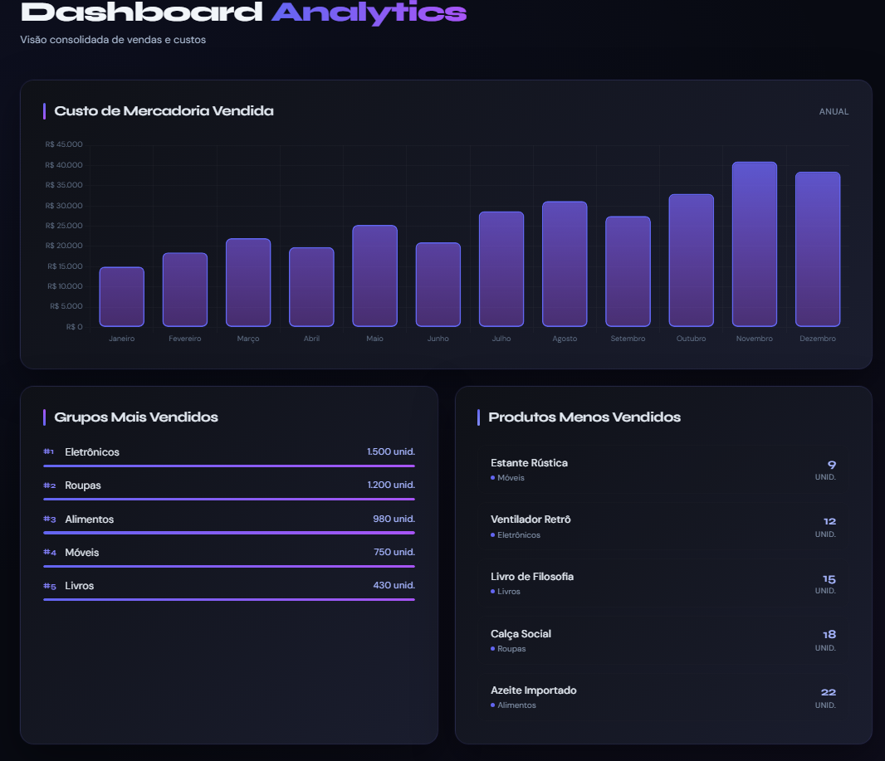

# Sifat Sistemas Developer Test — Frontend

Dashboard de vendas desenvolvido com React e TypeScript, consumindo a API do backend.

## Tecnologias

- React 19
- TypeScript
- Vite
- Chart.js + react-chartjs-2
- styled-components
- Axios
- Bun

## Pré-requisitos

- Bun
- Backend rodando em `http://localhost:3000`

## Como iniciar

**1. Instale as dependências:**

```bash
bun install
```

**2. Rode a aplicação:**

```bash
bun dev
```

O dashboard estará disponível em `http://localhost:8080`.

## Funcionalidades

| Componente | Descrição |
|---|---|
| `CmvChart` | Gráfico de barras com o custo de mercadoria vendida ao longo dos meses |
| `TopGroups` | Lista dos grupos mais vendidos com barra de progresso proporcional |
| `LeastSoldProducts` | Lista dos produtos menos vendidos com o grupo ao qual pertencem |

## Estrutura do projeto

```
src/
├── components/
│   ├── CmvChart/
│   │   ├── CmvChart.tsx
│   │   └── CmvChart.styles.ts
│   ├── TopGroups/
│   │   ├── TopGroups.tsx
│   │   └── TopGroups.styles.ts
│   └── LeastSoldProducts/
│       ├── LeastSoldProducts.tsx
│       └── LeastSoldProducts.styles.ts
├── services/
│   └── api.ts
├── types/
│   └── index.ts
├── App.tsx
├── App.styles.ts
└── main.tsx
```

## Estrutura visual do Dashboard

